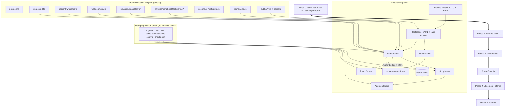

# Migration: Dev/End (React + Canvas 2D) → PhaserJS (full)

## Context

**Dev/End** is a JezzBall-style arcade game on **React 18 + TS + Vite**. It renders
by hand: raw Canvas 2D (`GameCanvas.tsx` 2,069 lines + `lib/rendering/renderFrame.ts`
854 lines), a custom 60 Hz fixed-step rAF loop (`useGameLoop.ts`), a bespoke physics
engine, procedural Web Audio (`gameAudio.ts`), pointer input (`useGameInput.ts`), and a
React/Radix/Tailwind/Framer UI.

**Goal (confirmed with the user):** a *full* migration into Phaser — gameplay **and**
menus become Phaser scenes; ball/wall physics moves onto Phaser's **Matter.js**; renderer
is **`Phaser.AUTO`** (WebGL + Canvas fallback); React/Radix UI is retired.

### What the code actually shows (drives the plan)

The "physics engine" is *intrinsically a region-ownership engine*, not a generic
rigid-body sim. This is the single biggest integration risk and shapes Phase 0:

- **Ball↔ball collisions only happen within the same region** — `handleBallCollisions.ts`:
  `if (ball1.regionId !== ball2.regionId) continue;`. Balls are perfectly elastic
  (`setBounce(1)`), zero gravity, zero `frictionAir`.
- **`updateBall.ts` is mostly region bookkeeping**, not bouncing: board-escape recovery
  (`pointInPolygon` → push inside + reassign `regionId`), then board/obstacle/user-wall
  collisions, then strict region containment via `isBallInRegion` / `findContainingRegion`
  / `constrainBallToRegion` (`regionOwnership.ts`).
- **Walls are transient line segments**, created per cut. `applyCut` (GameCanvas
  `1265`) rasterizes the cut path into `spaceGrid`, flood-fills connected regions
  (`findGridRegions`), deletes ball-less regions (`removeRegion`), and win = region grid
  %. None of this is a physics feature.
- **The cut** is a bidirectional ray-cast with mirror reflections
  (`wallGeometry.castRayWithReflections`) producing waypoint paths that animate via
  `updateWall` (GameCanvas `1559`).

**Implication for Matter.js:** Matter gives ball↔wall reflection for free, but we must
bolt the region model onto it: per-region **collision filters** so balls only collide
in-region, **dynamic static bodies** created/destroyed per cut, and the
`spaceGrid`/`regionOwnership` layer kept on top as the source of truth for capture and as
a containment safety net. Phase 0 must prove this composes before committing.

**Good news — large reuse surface.** These are already React-free and port verbatim:
`lib/polygon.ts`, `spaceGrid.ts`, `regionOwnership.ts`, `wallGeometry.ts`, `scoring.ts`,
`initGame.ts`, `gameAudio.ts`, `physics/updateBall.ts`, `physics/handleBallCollisions.ts`,
`ballRenderCache.ts` (logic), all `public/*.yml` + their parsers. The `use*Manager` hooks
hold pure progression logic but are wrapped in `useState`/`useCallback` and must be
re-expressed as plain stores (see Phase 4).

---

## Target architecture & dependency order

`*` updateBall/handleBallCollisions: the *region-bookkeeping tail* is reused; the
ball-move + reflection head is replaced by Matter (see Phase 2).

**Principle:** Phaser replaces rendering, loop, input, audio, scale, and UI shells. The
region model (`spaceGrid` + `regionOwnership`) stays authoritative and sits *on top of*
Matter, exactly as it sits on top of the custom physics today.

---

## Phase 0 — Scaffolding + Matter/region spike (HARD GATE)

1. Add `phaser` dep. Create `src/phaser/main.ts`: `new Phaser.Game({ type: Phaser.AUTO,
   scale: { mode: Phaser.Scale.FIT, autoCenter: CENTER_BOTH, width: BOARD_WIDTH,
   height: BOARD_HEIGHT }, physics: { default: 'matter', matter: { gravity: {x:0,y:0},
   debug: true } } })`. `BOARD_WIDTH/HEIGHT` come from `lib/boardConstants.ts`. Mount into
   a `
`; keep React app running in parallel behind `?phaser=1` so
   both builds run side-by-side for parity (Phase-by-phase verification).
2. **Spike scene (`SpikeScene`)** proving the riskiest coupling end-to-end:
   - Static Matter board walls from `initGame.ts` board polygon (`createWallsFromPolygon`
     edges → `Matter.Bodies.rectangle` static per edge, or `fromVertices`).
   - 3–4 `Matter.Sprite` balls, `setBounce(1)`, `frictionAir:0`, `setFriction(0)`,
     `restitution:1`.
   - **Region collision filter:** give each region a unique positive group id; set every
     ball body `collisionFilter = { group: regionGroup, category: BALL, mask: WALL }`.
     Same group ⇒ Matter always collides (in-region ball↔ball); different group ⇒ falls
     back to category/mask, and `mask` excludes `BALL` ⇒ no cross-region collision. This
     reproduces the `regionId !== regionId → skip` rule from `handleBallCollisions.ts`.
   - **One manual cut:** hard-code a swipe → `castRayWithReflections` (unchanged) →
     create Matter static wall bodies for each waypoint segment → run the *existing*
     `rasterizeCutToGrid` + `findGridRegions` + `removeRegion` from `spaceGrid.ts` →
     reassign each ball's `regionId` + collision group (`reassignBallsToRegions`).
3. **Gate criteria (must all pass or STOP and reassess Matter):**
   - Captured-area % computed from `spaceGrid` matches the React build for the same cut.
   - Balls never tunnel board/wall at top speed (Matter `positionIterations`/CCD tuned,
     or keep `constrainBallToRegion` as a post-step net).
   - Cross-region balls do not collide; in-region balls do.
   If any fail, escalate: fall back to running the existing custom physics inside the
   Phaser loop (keep Phaser for everything else) and flag to the user.

**Decision boundary recorded here:** `spaceGrid` + `regionOwnership` remain the
authoritative region/area/win model. Matter owns only ball motion + reflection + a static
wall-body mirror of `game.walls`.

---

## Phase 1 — BootScene: textures + YAML

- **Bake procedural visuals once** into Phaser textures (replaces per-frame Canvas 2D in
  `renderFrame.ts` + `ballRenderCache.ts`): port `ballRenderCache.getBallBase` /
  specular logic into `Graphics.generateTexture()` / `RenderTexture` calls producing a
  `ball-base-<color>` + `ball-specular` texture atlas; bake board grid and region-fill
  pattern. Sphere bands/hex overlay → either baked texture or a WebGL pipeline (Phase 2).
- **YAML loading:** in `BootScene.preload`, `this.load.text` each of
  `map.yml, game-config.yml, scoring-config.yml, upgrades.yml, certificates.yml,
  achievements.yml, colors.yml`, then parse with `js-yaml` + existing `zod` schemas
  (reuse the parsing bodies from `useGameConfig`/`useScoringConfig`/`useLevelManager`,
  extracted into plain functions). Show a Loader progress bar.

## Phase 2 — GameScene (core gameplay, highest payoff)

- **State:** instantiate the existing `CanvasGameState` shape from `initGame.ts`
  unchanged; `spaceGrid`, `regions`, `walls`, `balls` all reused.
- **Balls:** `Phaser.Physics.Matter.Sprite` per `Ball` using baked texture; sync
  `ball.position`/`velocity`/`regionId` ↔ Matter body each step. Rotation from Matter
  angular velocity (replaces manual `ball.rotation` in updateBall). Motion trail via a
  particle emitter / small `RenderTexture`. Won/assimilation state → tween scale+tint
  (replaces `assimilationAnimation.ts`).
- **Walls:** board edges + `obstaclePolygons` = static Matter bodies at scene create
  (`wallGeometry.createWallsFromPolygon`). User fences = static rectangles created on cut
  completion. Wall glow → additive sprite / post-FX, not per-frame strokes.
- **Physics split (the adaptation):**
  - *Replaced by Matter:* ball move + board/obstacle/user-wall reflection (the head of
    `updateBall.ts`, and `resolveBallLineCollision`).
  - *Kept on top, run in `update(time,delta)` after `matter.world.step`:* board-escape
    recovery, strict region containment (`isBallInRegion`/`findContainingRegion`/
    `constrainBallToRegion`), region reassignment, and `handleBallCollisions`' role is
    delegated to Matter collision filters (in-region only). Wall-impact FX + sounds fire
    from Matter `collisionstart` events (reuse `registerWallImpact`, `playWallHitSound`,
    `triggerWallHit`).
- **Cut input:** port `useGameInput.ts` pointer handlers to GameScene
  (`this.input.on('pointerdown/move/up')`); use Phaser camera/Scale for screen→world
  instead of `boardConstants.screenToWorld`/`BoardRect`. Reuse `castRayWithReflections`,
  `isPositionActive`, `findRegionContainingPoint`, `BASE_SWIPE_MIN_DISTANCE`,
  instant-fence modifier logic unchanged. Growing-wall animation → a Tween over waypoint
  segments (replaces accumulator `updateWall`).
- **Cut completion / capture:** call the existing `applyCut` body (GameCanvas `1265`)
  nearly verbatim — `rasterizeCutToGrid`, `findGridRegions`, region removal,
  `reassignBallsToRegions`, `checkAndUpdateBallWonStates`, ball speed-up, MicroManager cap.
  Render captured regions by toggling tiles in a `RenderTexture`.
- **FX:** wall flashes (`wallImpactEffects.ts`) → particle bursts/tweens; CRT phosphor +
  neon rim + scanlines + data-rain (`CRTBackground.tsx` + rain in `renderFrame.ts`) → a
  Phaser WebGL **post-FX pipeline** `src/phaser/fx/CrtPipeline.ts` on the camera. Camera
  shake/flash/fade for hits, level-complete dissolve (replaces the dissolve block in
  `useGameLoop.ts`).
- **Loop:** delete `useGameLoop.ts`; Matter + Scene `update` own stepping. Configure
  Matter fixed timestep to preserve `PHYSICS_STEP` (`gameConstants.ts`) semantics.

## Phase 3 — Audio

- Keep `gameAudio.ts` (pure Web Audio) and call `playWallHitSound`/`playBallCollideSound`
  etc. from Scene/Matter events. Web Audio coexists with Phaser; `initAudio()` on first
  pointer (already gated in `useGameInput`). Optional later move to `this.sound`.

## Phase 4 — UI scenes (full Phaser-native rewrite) + de-Reacted stores

This is the largest phase. Two parts:

1. **Extract progression logic into plain stores.** Each `use*Manager` hook holds pure
   logic behind `useState`/`useCallback`; re-express as framework-agnostic classes or a
   small event-emitter store (no React): `useUpgradeManager`, `useCertificateManager`,
   `useAchievementManager`, `useScoring`/`useScoringConfig`, `useLevelManager`,
   `useCheckpoint(Manager)`, `useMetaProgression`, `useActiveModifiers`,
   `useColorProgression`, `useTutorialManager`. Keep the YAML parsing + `zod` schemas;
   move `localStorage` persistence as-is. These back every scene.
2. **Rebuild each screen as a Phaser Scene** using **Phaser DOM elements** (or `rexUI`):
   `WelcomeScreen→MenuScene`, `UpgradeShop→ShopScene`, `AugmentStore→AugmentScene`,
   `ResultScreen→ResultScene`, `AchievementsScreen→AchievementsScene`,
   `Options/Tutorial→Menu sub-scenes`, and overlays (`LevelCompleteOverlay`,
   `PushYourLuckOverlay`, `InteractiveTutorialOverlay`, `CheckpointPicker`,
   `GameTopBar`, `GameStatsPanel`) as Phaser overlay scenes launched in parallel over
   GameScene. Scene transitions replace the `useGameState` screen state machine
   (`welcome/game/upgradeShop/augmentStore/result/options/tutorial/achievements`).
- **Admin tools** (`MapBuilder`, `MapCanvas`, `PlaygroundScreen`, `AdminScreen`) are
  dev-only — leave them on the existing React/Canvas build behind `?admin=true`; do not
  port to Phaser.

## Phase 5 — Cleanup

- Once parity confirmed, delete `GameCanvas.tsx`, `rendering/renderFrame.ts` + `types.ts`,
  `useGameLoop.ts`, `useGameInput.ts`, `ballRenderCache.ts`, `CRTBackground.tsx`,
  `MemoryParallaxLayer.tsx`, `boardConstants.ts`, and the React game UI + now-dead Radix
  deps. Remove the parallel-build `?phaser=1` flag and make Phaser the default. Keep
  `vite.config.ts` map-editor API plugin if admin is retained.

---

## Critical files

**Ported verbatim:** `lib/polygon.ts`, `lib/spaceGrid.ts`, `lib/regionOwnership.ts`,
`lib/wallGeometry.ts`, `lib/scoring.ts`, `lib/initGame.ts`, `lib/gameAudio.ts`,
`lib/gameConstants.ts`, `public/*.yml`.

**Adapted (physics boundary):** `physics/updateBall.ts` (region-tail kept, move/reflection
head → Matter), `physics/handleBallCollisions.ts` (→ Matter collision filters), `applyCut`
+ `updateWall` bodies lifted out of `GameCanvas.tsx`.

**Replaced by Phaser:** `GameCanvas.tsx`, `rendering/renderFrame.ts`, `useGameLoop.ts`,
`useGameInput.ts`, `ballRenderCache.ts` (→ Boot textures), `CRTBackground.tsx`,
`MemoryParallaxLayer.tsx`, `boardConstants.ts` (→ camera/Scale).

**De-Reacted to plain stores:** all `src/hooks/use*Manager.ts`, `useScoring`,
`useActiveModifiers`, `useColorProgression`, `useTutorialManager`, `useCheckpoint*`,
`useGameState` (→ scene transitions).

**New:** `src/phaser/main.ts`, `src/phaser/scenes/{Boot,Menu,Game,Shop,Augment,Result,
Achievements}Scene.ts`, overlay scenes, `src/phaser/objects/{Ball,Wall,Region}.ts`,
`src/phaser/fx/CrtPipeline.ts`, `src/phaser/stores/*`.

---

## Verification

- **Phase 0 gate (blocking):** spike scene area-% from `spaceGrid` matches the React build
  for an identical cut; no tunneling at top speed; cross-region balls don't collide. If
  not met, fall back to custom-physics-inside-Phaser and flag the user before Phase 2.
- **Parity per phase:** run React build (`npm run dev`) and Phaser build (`?phaser=1`)
  side by side; compare bounce angles, cut placement, capture %, lock/assimilation
  animation, scoring numbers, push-your-luck, level-complete dissolve.
- **Automated:** existing `vitest` suites for pure logic (polygon, spaceGrid, scoring)
  must pass unchanged — they are the safety net for the physics adaptation. Extend
  `@playwright/test` E2E to drive a full level on the Phaser build
  (start → cut → capture → shop → next level).
- **Performance:** Phaser debug overlay FPS/frame-time vs Canvas at equal ball counts;
  confirm `Phaser.AUTO` selects WebGL and the Canvas fallback still runs.
- **Visual:** side-by-side of CRT/neon/rain (post-FX pipeline vs `CRTBackground.tsx`)
  before deleting the old renderer.

## Risk callouts (acknowledged, proceeding anyway per user choice)

1. **Matter + region model** is the top risk — mitigated by the Phase-0 hard gate and
   keeping `spaceGrid`/`regionOwnership` authoritative on top of Matter.
2. **Full Phaser UI rewrite** is the largest effort — many screens/overlays plus
   de-Reacting ~12 manager hooks into plain stores. It is the last phase so the project
   can ship gameplay first and stop early if the trade stops paying off.